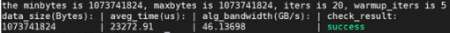
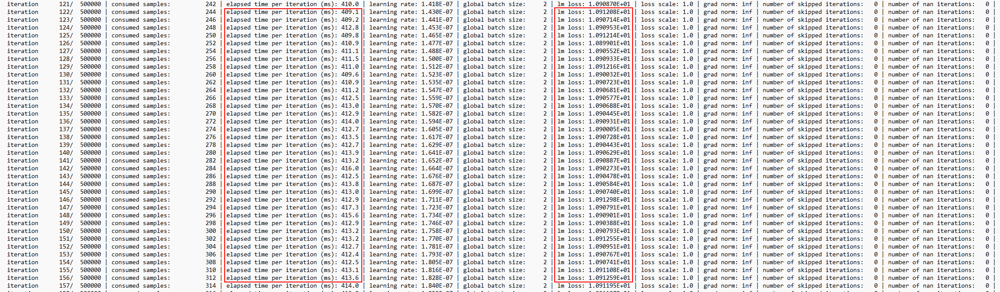

# testcases介绍

1. 镜像基于ubuntu18.04基础镜像构建，包含训练、集合通信测试、物理算力测试和有效算力验收功能。镜像中包含MindSpore框架、pytorch1.11.0、python3.7.5、toolkit和toolbox软件包，并且内置了用于集群训练的GPT3模型和用于有效算力验收的resnet50、bert-large模型。
2. 创建config目录，将node_rank、hostfile和hccl_tool.py放置该目录下：
```
    mkdir -p /home/hwtest/config
    cp node_rank hostfile hccl_tool.py /home/hwtest/config
    chown -R HwHiAiUser:HwHiAiUser /home/hwtest/config
```

3. 为了成功验证，需要独占环境，脚本会杀掉其他执行中的进程，请用户注意并自行处理可能出现的问题。
4. 建议用户[手动编译apex包](https://gitee.com/ascend/apex)替换镜像中的apex版本，不同架构对应的apex包不同。
   编译好whl包后执行：

   ```
   pip3 install --upgrade apex-0.1_ascend-cp37-cp37m-linux_$(arch).whl
   ```
6. hccl_test.sh, flops_test.sh, ais_bench.sh和sever_train.sh中容器启动的默认镜像为ascendhub.huawei.com/public-ascendhub/testcases:23.0.0-ubuntu18.04，
用户可根据实际情况进行修改。
7. test_model.sh为入口脚本，可以接受参数all（无参数时，默认为all）、hccl-test、flops-test、distributed、ais-flops，all会将所有测试项依次执行，需要准备好所有必要的先置条件（参考后续单项测试功能介绍）；其他参数分别对应hccl集群通信验证、物理机算力测试、集群训练、有效算力验收。
```
   source test_model.sh &
   或者
   source test_model.sh all & 
```
8. 镜像支持Atlas 900 A2 PoD，Atlas 800T A2和Atlas 200T A2 Box16形态产品。
9. 镜像内软件版本，配套23.0.0的驱动固件。

| 镜像版本   | CANN版本 | 框架版本                          | toolbox版本 | 变更项 |
|--------|--------|-------------------------------|-----------|-----|
| 23.0.0 | 7.0.0  | MindSpore 2.2.10,Torch 1.11.0 | 5.0.0     |     |

## hccl-test集合通信

1. 检查集群环境的健康状态，可使用hccn_tool工具进行检查。
2. 免密配置，主节点需可免密登录其他工作节点，配置方法如下：
```
    ssh-keygen        #生成密钥
    ssh-copy-id -i /root/.ssh/id_rsa.pub root@192.168.150.148  # 复制密钥到要免密登录的设备
```

3. 配置参与集群测试的节点的ssh服务端口，在每个节点的~/.ssh/config文件中添加如下格式内容，Host为参与测试的节点ip，Port统一填33333。
```
    Host 51.38.65.157
    Port 33333
    Host 51.38.68.149
    Port 33333
```
4. 修改hostfile文件，文件位于config目录下，配置格式”节点IP:每节点进程数“，该配置方式仅支持使用IPv4协议进行通信的场景，第一个节点IP为主节点。
```
    # 训练节点ip:每节点进程数
    51.38.65.157：8
    51.38.68.149：8
```
5. 所有参与测试的集群节点准备hccl_test.sh测试脚本，可参考代码中hccl_test.sh进行修改。
```
    mkdir -p /home/hwtest/hccl
    cp hccl_test.sh /home/hwtest/hccl
```
6. 执行`source test_model.sh hccl-test`。
7. 检查执行日志，日志位于/home/hwtest/hccl/hccl_test.log，结果如下，表示测试成功：
<div align=center>

</div>

8. 完成测试后请恢复~/.ssh/config参与集群测试的节点的ssh服务端口。

## 物理算力测试

1. 所有参与测试的节点准备测试脚本flops_test.sh，可参考代码中flops_test.sh进行修改。
```
    mkdir -p /home/hwtest/flops
    cp flops_test.sh /home/hwtest/flops
    chown -R HwHiAiUser:HwHiAiUser /home/hwtest/flops
```
2. 执行`source test_model.sh flops-test`。
3. 检查执行日志，日志位于/home/hwtest/flops/flops_test.log。
4. 确保所有数据集和文件的属主为HwHiAiUser。
## 集群训练

集群训练支持gpt3模型，数据集为enwiki数据集，需从物理机挂载，该模型不支持910A系列产品。

1. 默认镜像：`ascendhub.huawei.com/public-ascendhub/testcases:23.0.0-ubuntu18.04`，可修改image字段来修改使用的镜像。
2. 准备node_rank文件，第一行节点为master节点，格式如下：
```
  172.19.20.26 0 master
  172.19.20.27 1
  172.19.20.28 2
  172.19.20.29 3
```
3. 所有参与测试的集群节点准备测试脚本sever_train.sh和pretrain_gpt_distributed_bf16_test.sh，可参考代码仓中的脚本进行修改。

修改sever_train.sh文件的train_data，该字段为训练数据集的保存路径，生成数据集可参考[这里](https://gitee.com/ascend/Megatron-LM)。

修改pretrain_gpt_distributed_bf16_test.sh脚本：

| 变量名          | 描述                                      |
|--------------|-----------------------------------------|
| NPU_PER_NODE | 每个节点的NPU数量，可修改                          |
| MASTER_PORT  | 网络端口，可修改                                |
| LOCAL_ADDR   | 集群中所有服务器的业务网口IP地址，建议根据实际情况修改            |
| NNODES       | 节点数量，可修改                                |
| NODE_RANK    | 每个节点的rank编号，不建议修改                       |
| WORLD_SIZE   | 集群中所有NPU数量，不建议修改                        |
| DATA_PATH    | 训练数据集路径，my-t5_text_sentence为训练数据的前缀，可修改 |

```
    mkdir -p /home/hwtest/distributed
    cp sever_train.sh pretrain_gpt_distributed_bf16_test.sh /home/hwtest/distributed
    chown -R HwHiAiUser:HwHiAiUser /home/hwtest/distributed
```
4. 执行`source test_model.sh distributed`。
5. 检查执行日志，日志位于/home/hwtest/distributed/train_auto.log，日志如下表示正常的进行训练。

6. 确保所有数据集和文件的属主为HwHiAiUser。
## 有效算力验收

testcases镜像作为有效算力验收时使用的镜像，支持resnet50和bert-large模型。

1. 所有参与测试的节点准备hccl_tool.py文件，可参考代码仓中config下的同名文件，该文件用于生成hccl.json文件。
2. 所有参与测试的节点准备数据集，resnet50模型算力验收需准备imagenet2012数据集；bert-large模型算力验收需准备en-wiki-512数据集、评估数据集和预训练模型。
3. 所有参与测试的节点准备脚本ais_bench.sh，可修改如下字段：

| 变量名                 | 描述                                               |
|---------------------|--------------------------------------------------|
| TRAIN_DATA_PATH     | 训练数据集路径                                          |
| EVAL_DATA_PATH      | 验证数据集路径                                          |
| PRETRAIN_MODEL_PATH | 预训练模型路径，TYPE为bert-large时需要指定该参数，为resnet50时请注释该变量 |
| TYPE                | 模型类型为resnet50和bert-large                         |

```
    mkdir -p /home/hwtest/ais
    cp ais_bench.sh /home/hwtest/ais
    chown -R HwHiAiUser:HwHiAiUser /home/hwtest/ais
```
4. 执行`source test_model.sh ais-flops`。
5. 检查执行日志，resnet50日志位于/root/ais_log/resnet_log，bert-large日志位于/root/ais_log/bert_log。
6. 确保所有数据集和文件的属主为HwHiAiUser。